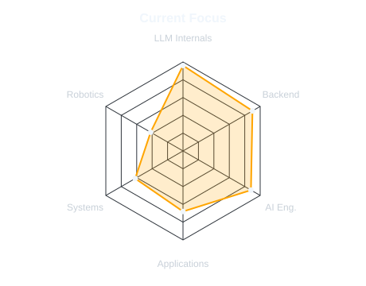
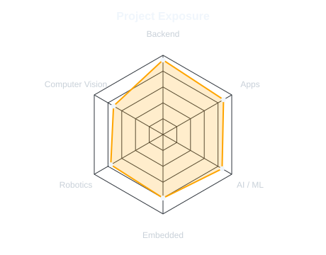

<!-- =========================================================
     HERO / TERMINAL BANNER
     NOTE: this repository folder is intentionally named "assests".
     ========================================================= -->

<picture>
  <source media="(prefers-color-scheme: dark)" srcset="assests/banner-dark.v3-gif-faithful.svg">
  
</picture>

&nbsp;&nbsp;

&nbsp;&nbsp;

This is me :)
Hi, I'm Nityant, a software developer building depth in backend engineering while exploring AI engineering and language-model systems.
I like understanding what happens underneath a system before abstracting it away — from Transformer internals and inference mechanics to backend architecture, databases, deployment, and the software surrounding intelligent systems.
- 🧠 Going deeper into Transformers, attention, embeddings, inference, retrieval, reasoning, and evaluation.
- ⚙️ Building depth in Java, Spring Boot, APIs, databases, testing, concurrency, Linux, and production backend systems.
- 🔬 Building LLM Visualizer to make model internals, tensors, layers, and token-level computation easier to inspect.
- 📓 Developing LLM Engineering Notebook as an understanding-first environment for architecture, experiments, and implementation.
- 📱 Built cross-platform applications with Flutter, alongside backend systems using Spring Boot, FastAPI, PostgreSQL, and MongoDB.
- 🤖 Previous engineering work includes computer vision, embedded systems, STM32/ESP32, robotics, and ROBOCON systems.
- 🚀 Interested in software/backend/AI engineering internships, technical collaborations, and meaningful open-source work.

<h2 align="center">my perfect stack :)</h2>

  

<h2 align="center">signals</h2>

<table width="100%">
<tr>
<td width="50%" align="center" valign="middle">

<td width="50%" align="center" valign="middle">

</tr>
</table>

  Focus / project exposure — not proficiency scores.

<h2 align="center">Numbers matter? ohhh yes.</h2>

  

  

  <code>Building · breaking · understanding · building again · @TheNityant</code>

